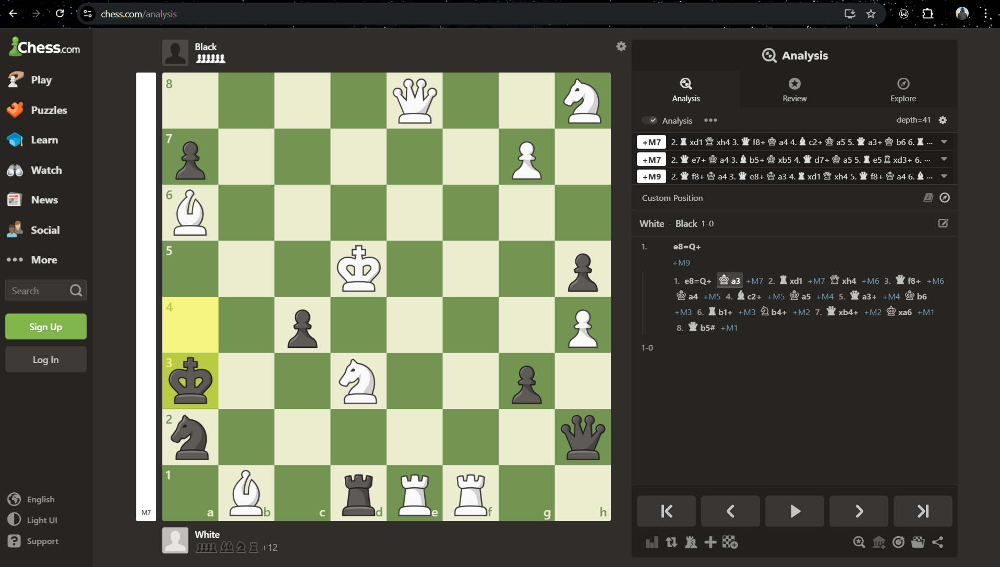
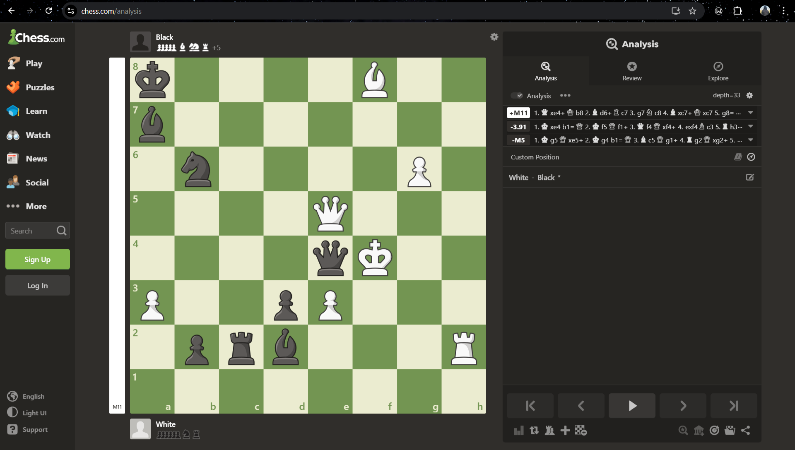
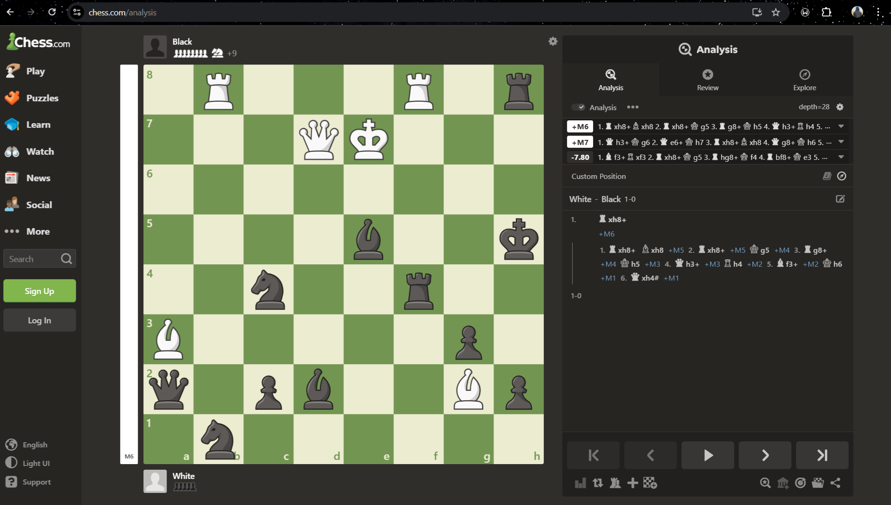

# AI-Powered Chess Puzzle Generator

Generate challenging chess puzzles using AI and genetic algorithms.

This project uses a genetic algorithm (GA) combined with Stockfish, a powerful chess engine, to automatically generate hard chess puzzles. The AI evaluates board positions, evolves them over generations, and creates puzzles that are tricky even for experienced players.

---

## Features

- **AI-driven puzzle creation:** Uses Stockfish to analyze positions and determine tactical depth.
- **Genetic Algorithm:** Evolves chess positions to maximize challenge.
- **Adaptive difficulty:** Can generate puzzles that are hidden wins, sacrifices, or require deep calculation.
- **Customizable:** You can set Stockfish depth and save generated puzzles to a file.

---

## How It Works

1. **Random Board Generation:** The system creates a random legal chess position.
2. **Evaluation:** Stockfish analyzes the position to determine which moves lead to mate or significant advantage.
3. **Genetic Algorithm:** Positions “mate” with each other to create new boards. Random moves or pieces are sometimes added to increase difficulty.
4. **Fitness Calculation:** Positions are scored based on Stockfish evaluation, mate-in moves, material, and hidden tactical opportunities.
5. **Iteration:** Over multiple generations, the system evolves positions toward harder puzzles.
6. **Output:** The most challenging puzzles are saved to a file.

---

## Example
Here are some examples of generated chess puzzles:

**FEN :** `7N/p3P1P1/B7/3K3p/k1p4P/3N2p1/n6q/1B1rRR2 w - - 0 1`


**FEN :** `k4B2/b7/1n4P1/4Q3/4qK2/P2pP3/1prb3R/8 w - - 0 1`


**FEN :** `R3R1r/3QK3/8/4b2k/2n2r2/B5p1/q1pb2Bp/1n6 w - - 0 1`


## Installation

1. **Clone the repository:**

```bash
git clone https://github.com/Mayank-Golchha/ChessPuzzleGen.git
cd ChessPuzzleGen
```

2. **Install required Python libraries:**

```bash
pip install -r requirements.txt
```
3. **Download and install the Stockfish engine:**
Stockfish is a free and powerful chess engine used for evaluating positions. Download it here:
https://stockfishchess.org/download/

4. **Save the path of the Stockfish executable:**
Put the stockfish executable path in the file named stockfish_path.txt in the project folder

5. **Run The Generator:**
```bash
py chess_puzzle_generator.py
```

---
## Notes

Stockfish Depth: Higher depth = stronger AI evaluation but slower puzzle generation.

AI Difficulty: The GA tries to find positions where lower-depth analysis misleads, making puzzles more challenging.

Legal Compliance: Stockfish is not included in this repo; users must download it separately.

Custom Difficulty: You can tweak GA parameters, Stockfish depth, or allow more hidden tactical moves for harder puzzles.
